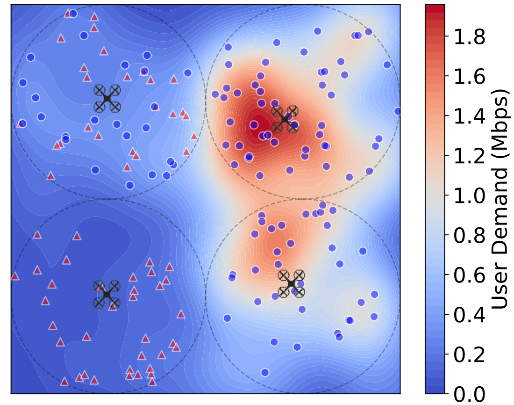
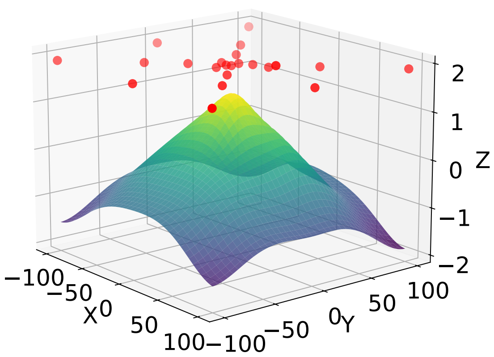
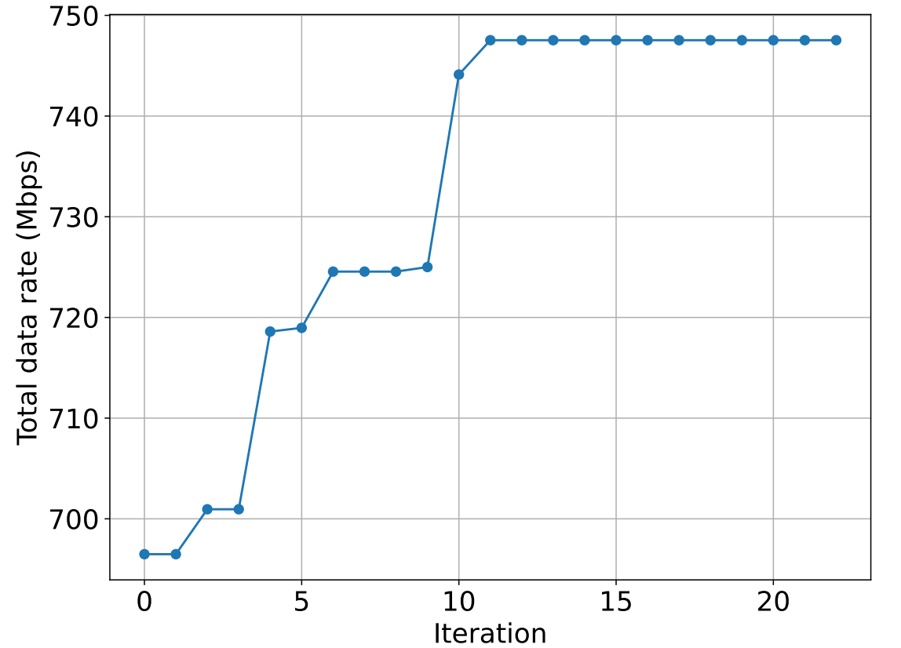
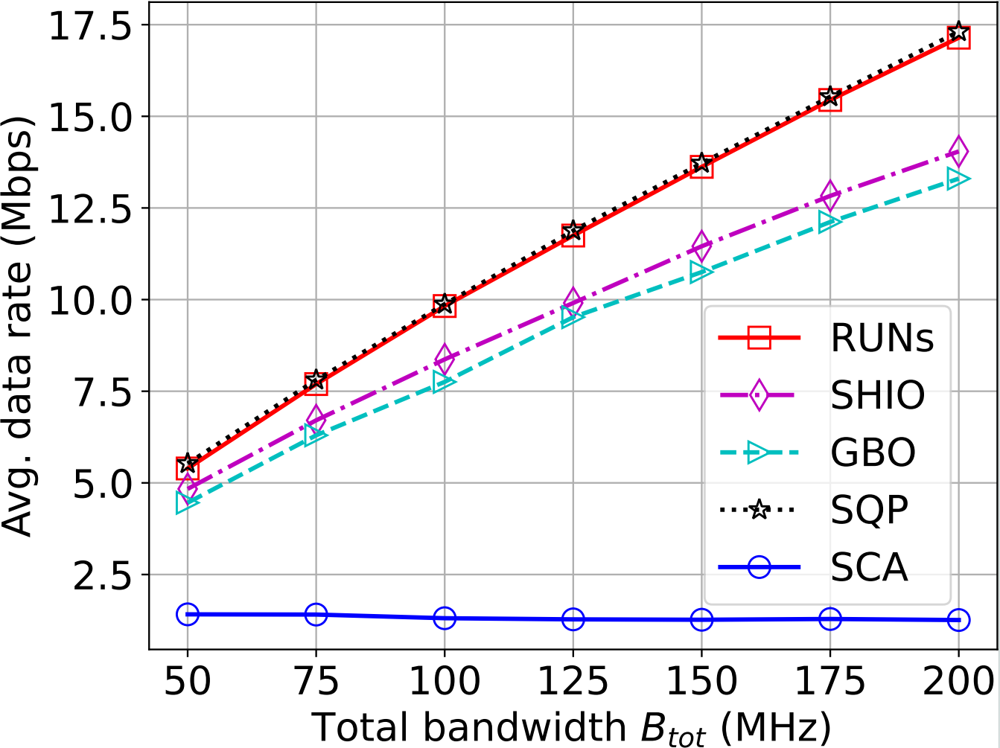
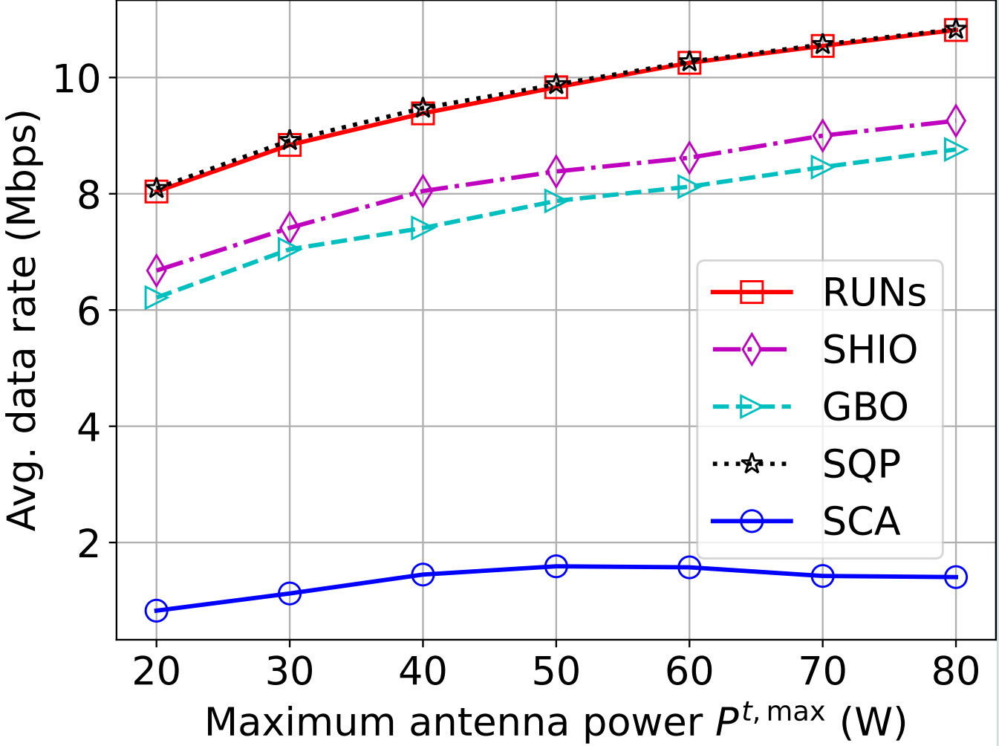
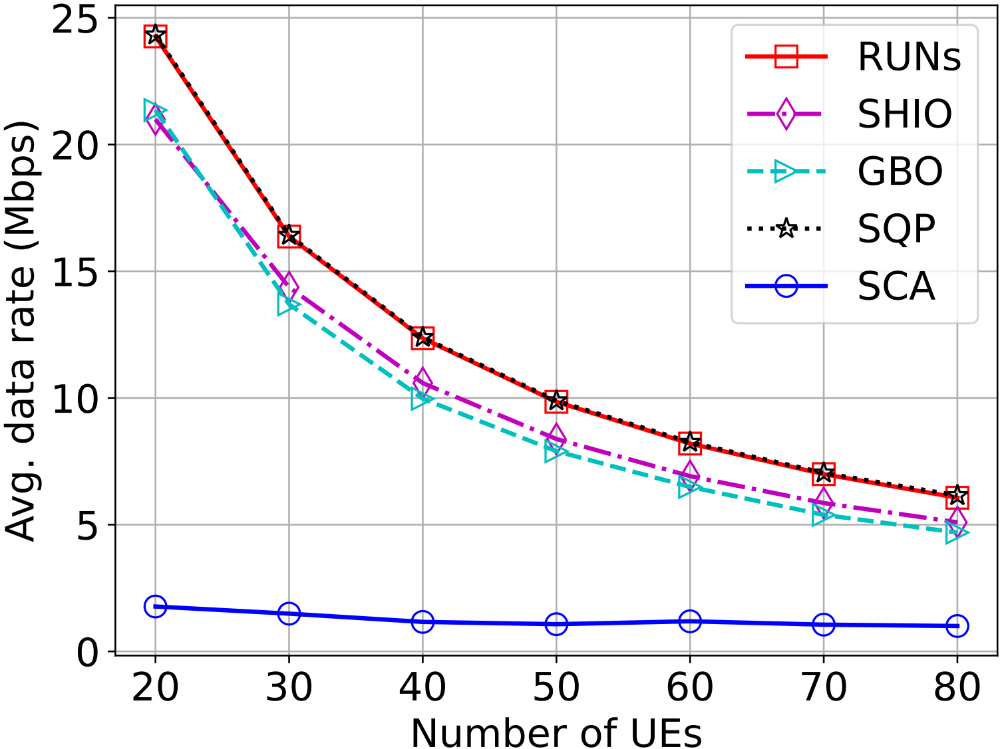
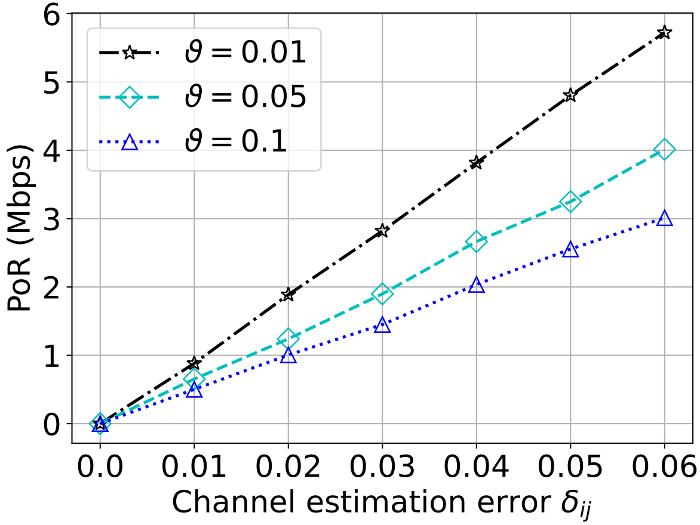
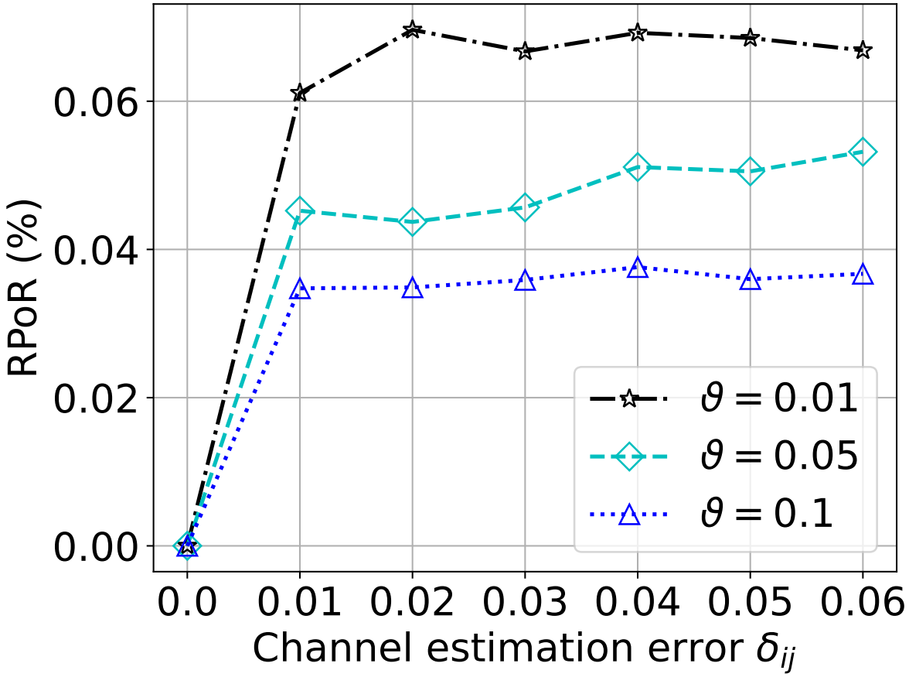

# The RUNs Framework for Fast and Robust UAV Network Slicing - Simulation Code

[](LICENSE)
[](https://www.python.org/)

This repository contains the simulation code for the RUNs Framework UAWN Slicing.


## 🚀 Quick Start
### Installation

#### 1. Install Python 3.12
If you use conda, run the following command:
```bash
conda create -n runs python=3.12
conda activate runs
```

#### 2. Install dependencies
Run the following command, all dependencies will be installed:
```bash
pip install -e .
```

### Run Simulation
This repository contains has multiple entrypoints to run the simulation.

#### 1. BO-eanbled RUNs framework for 3D UAV deployment and slicing

The following command will generate a four-cell UAWN scenario.
```bash
python -m experiment_horizontal.four_cell_scenario
```


Run Bayesian optimization (BO)-eanbled RUNs framework by
```bash
python -m algorithms.MP_Relax_algorithms.main_algorithm.Bayesian_opt.BO_horizontal
```
You will get the following results.





#### 2. Comparing RUNs with benchmarks

**Note: the following commands read our previous results from exiting excel files.
If you want to run the simulation by yourself, please see the code of these scripts, each of which contains a run() function.**


Run the following commands to see our comparisons with existing benchmarks, including SCA, SQP, SHIO, and GBO.

1). Comparison under different available bandwidths.

```bash
python -m experiment_comparison.comparison_B
```



2). Comparison under different available powers.

```bash
python -m experiment_comparison.comparison_P
```


3). Comparison under different numbers of users.

```bash
python -m experiment_comparison.comparison_nUE
```




#### 3. Robustness of RUNs

Run the following command to see the price of robustness (PoR) and relative PoR (RPoR) of RUNs.
```bash
python -m experiment_robustness.DAL_CSI_robustness
```




For the detailed design principles of RUNs, please refer to our paper.

## 🤝 Contributing
Pull requests are welcome. For major changes, please open an issue first.